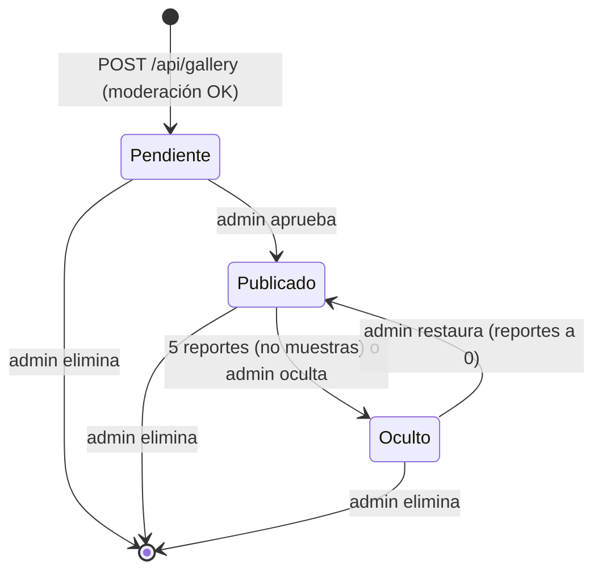

# Almacenamiento

Webflow Cloud ofrece D1, KV y R2, declarados en `wrangler.json`
([docs](https://developers.webflow.com/webflow-cloud/storing-data/overview)).
Kalko usa KV y R2. Se accede con `getCloudflareContext()` dentro de cada
función, nunca a nivel módulo.

KV es eventualmente consistente y no admite operaciones atómicas
([How KV works](https://developers.cloudflare.com/kv/concepts/how-kv-works/)).
Por eso todos los contadores (cupos, reportes, me gusta) son aproximados.

## `RATE_LIMIT_KV`

| Clave | Valor | TTL |
|---|---|---|
| `rl:<tipo>:<ip hasheada>:<AAAA-MM-DDTHH>` | usos en la hora (UTC) | 3700 s |
| `rl:daily:<AAAA-MM-DD>` | imágenes del día (global) | 2 días |
| `diag:<uuid>` | prueba del diagnóstico de admin | 60 s |

Tipos: `text`, `image`, `publish`, `report`, `like`, `login`. La IP sale de
`cf-connecting-ip` (o `x-forwarded-for` si falta), con SHA-256 y un prefijo
fijo, truncada a 12 bytes. No se guarda la IP en claro.

## `GALLERY_KV`

Cada sticker vive en una lista según su estado. La clave ordena de más
nuevo a más viejo (timestamp invertido) y la **metadata** de la clave
lleva el `GalleryItem`, así que listar no requiere leer cada valor.

| Clave | Contenido |
|---|---|
| `p:<ts invertido>:<id>` | pendiente de aprobación |
| `g:<ts invertido>:<id>` | publicado |
| `h:<ts invertido>:<id>` | oculto (reportado o por el admin) |
| `idx:<id>` | clave actual del sticker (para cambiar de estado) |
| `rc:<id>` | cantidad de reportes |
| `rp:<id>:<visitante>` | reporte ya hecho por ese visitante (30 días) |
| `lc:<id>` | cantidad de me gusta |
| `lk:<id>:<visitante>` | me gusta ya dado por ese visitante |

`GalleryItem`: `{ id, name, style, idea, holo, ts, example?, reports?, likes? }`.

- `id`: 16 caracteres hex. Aleatorio para los usuarios; para las muestras
  del home, `sha256("kalko-example:<slug>")` truncado (la importación es
  idempotente).
- La metadata de KV admite 1024 bytes
  ([límites](https://developers.cloudflare.com/kv/platform/limits/)):
  `name`, `style` e `idea` se recortan por bytes (120/200/380).
- `example: true` marca las muestras. Se listan aparte en la galería
  ("Muestras del laboratorio") y nunca se ocultan solas por reportes.

## `GALLERY_R2`

- `img/<id>`: la imagen (WebP o PNG, ~768 px) con su `contentType`.
- R2 en Webflow Cloud no admite buckets públicos: se sirve por
  `GET /api/gallery/<id>` solo si el sticker está publicado.

## Ciclo de vida de un sticker

