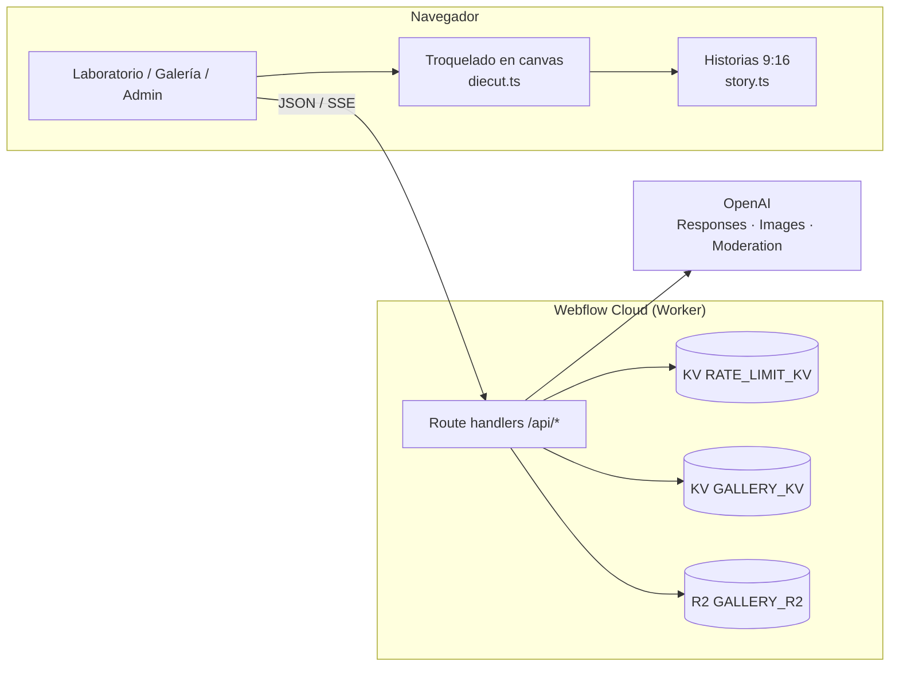
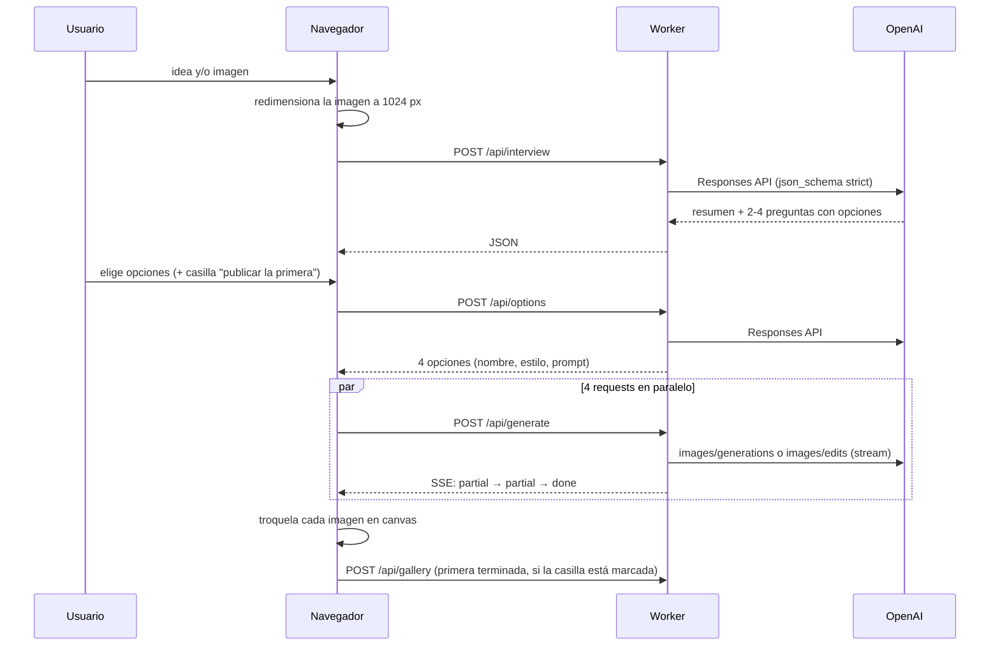

# Arquitectura

Kalko es una app Next.js 15 (App Router, React 19, TypeScript) desplegada
en **Webflow Cloud**, que la ejecuta sobre Cloudflare Workers mediante
`@opennextjs/cloudflare`. Todo el procesamiento de imagen que no es IA
(troquelado, hojas A4, formatos para compartir) corre en el navegador; el
servidor solo orquesta OpenAI, guarda la galería y aplica límites.

## Piezas

| Capa | Dónde | Qué hace |
|---|---|---|
| Páginas | `src/app/page.tsx` (home), `laboratorio/`, `galeria/`, `admin/` | UI; todas son client components salvo el home |
| API | `src/app/api/**/route.ts` | Route handlers `force-dynamic` |
| IA | `src/lib/openai.ts`, `src/lib/schemas.ts` | Llamadas a OpenAI y prompts/JSON schemas |
| Validación | `src/lib/validate.ts` | Lectura segura del body, imágenes, errores |
| Límites | `src/lib/ratelimit.ts` | Cupos por IP y tope diario en KV |
| Galería | `src/lib/gallery.ts` | Estados, reportes y me gusta en KV + imágenes en R2 |
| Admin | `src/lib/admin.ts` | Sesión firmada con HMAC |
| Imagen en cliente | `src/lib/diecut.ts`, `src/lib/story.ts` | Troquel, A4, WhatsApp, historias |
| Componentes | `src/components/` | Portal, mascotas, StickerView (vinilo), StickerZoom (3D), StoryShare |

## Flujo del laboratorio

1. **Entrada:** texto (hasta 600 caracteres) o imagen PNG/JPEG/WebP
   redimensionada en el cliente. `?idea=` precarga el texto (lo usan las
   muestras del home).
2. **Entrevista:** el modelo de chat devuelve `summary` y 2-4 preguntas con
   opciones cerradas. No hay chat libre.
3. **Opciones:** con las respuestas, devuelve 4 conceptos con un prompt en
   inglés que incluye las reglas de sticker (`STICKER_RULES`).
4. **Generación:** una imagen por request; el cliente dispara las 4 a la
   vez y pinta las vistas parciales a medida que llegan.
5. **Troquelado y acabados:** en el navegador (ver abajo). Cambiar borde,
   color o línea de corte re-troquela en ~1 s sin volver a llamar a la IA.
6. **Refinar:** `instruction` + la imagen de la tarjeta como `reference`
   → edición. El cliente guarda el historial para deshacer.
7. **Salidas:** PNG, hoja A4, sticker de WhatsApp, historia 9:16 con 3
   plantillas, publicación en la galería.

## Streaming y el timeout de 20 s

Webflow Cloud corta con 504 una respuesta que no envía bytes en 20 s
(medido: 504 a los 20,3 s; un SSE de 33 s con chunks cada 3 s respondió
200). Una imagen tarda 9-12 s con `quality: low`, pero con cola o edición
puede pasar los 20 s. Por eso `/api/generate`:

- abre la respuesta SSE de inmediato;
- reenvía los `partial_image` de OpenAI (`partial_images: 2`);
- manda `: ping` cada 4 s como keep-alive;
- ante un 429 de OpenAI (límite de 5 imágenes/min de la organización)
  envía `{type:"queued"}`, espera lo que indica el mensaje y reintenta
  hasta 5 veces, con el stream ya abierto. No reintenta si el 429 es por
  gasto o cupo agotado.

Eventos al cliente: `partial`, `done`, `queued`, `error`.

## Procesamiento en el navegador

- **Troquel** (`diecut.ts`): umbral de alfa (70/170) para limpiar el halo
  semitransparente que agrega el modelo; campo de distancias chamfer 5×5,
  cacheado por imagen (hasta 12), para dilatar el borde fino/medio/grueso
  (14/24/36 px); relleno blanco, portal u holográfico; línea de corte
  magenta punteada opcional. Se procesa de a una tarjeta cediendo el hilo
  principal.
- **Hoja A4:** 2480×3508 px (300 dpi), grilla 2×3 o 2×2.
- **WhatsApp:** WebP 512×512 de 100 KB como máximo con 16 px de margen
  ([spec](https://github.com/WhatsApp/stickers/blob/main/Android/README.md)).
  Safari no codifica WebP en canvas y cae a PNG.
- **Historias** (`story.ts` + `StoryShare.tsx`): 1080×1920 JPEG con tres
  plantillas (Portal, Holográfico, Ficha de laboratorio), todas con el
  pie "Créalo en kalko.webflow.io". Se comparten con la Web Share API
  (en el celular aparece Instagram); sin soporte, se descargan.
- **Publicación:** WebP 768 px (0,86), PNG si el navegador no codifica WebP.

## Límites de la plataforma

Fuente: https://developers.webflow.com/webflow-cloud/limits

| Límite | Valor | Impacto |
|---|---|---|
| Respuesta sin bytes | 20 s | SSE + keep-alive en `/api/generate` |
| CPU por request | 30 s | Troquel en el cliente, no en el worker |
| Memoria | 128 MB | Límite de tamaño de body antes de parsear |
| Bundle del worker | 10 MB | Sin dependencias pesadas de imagen en el server |
| Variables de entorno | requieren redeploy | Cambiar un cupo implica redeploy |
| R2 | sin buckets públicos | Las imágenes se sirven por `/api/gallery/<id>` |

Además, Webflow sirve los assets de `_next/` desde otro origen
(`<id-entorno>.wf-app-prod.cosmic.webflow.services`, vía `ASSETS_PREFIX`).
Dos consecuencias: la CSP debe incluir ese origen, y un `url()` relativo
dentro de una custom property CSS se resuelve contra la hoja de estilos
(ese origen), así que las máscaras se pasan a URL absoluta
(`src/components/useMask.ts`).

## Configuración

Variables de entorno (Webflow Cloud → entorno `main`; las nuevas requieren
redeploy):

| Variable | Default | Uso |
|---|---|---|
| `OPENAI_API_KEY` (secret) | — | Única credencial de IA |
| `OPENAI_CHAT_MODEL` | `gpt-6-luna` | Entrevista y opciones |
| `OPENAI_IMAGE_MODEL` | `gpt-image-2.5-flare` | Generación y edición |
| `OPENAI_IMAGE_QUALITY` | `low` | Calidad de imagen |
| `OPENAI_MODERATION_MODEL` | `omni-moderation-latest` | Moderación de la galería |
| `ADMIN_USER` / `ADMIN_PASSWORD` (secret) | — | Backoffice; sin ellas queda deshabilitado |
| `RL_TEXT_PER_HOUR` | 40 | Entrevista + opciones por IP |
| `RL_IMAGES_PER_HOUR` | 24 | Imágenes por IP |
| `RL_PUBLISH_PER_HOUR` | 6 | Publicaciones por IP |
| `RL_REPORT_PER_HOUR` | 20 | Reportes por IP |
| `RL_LIKE_PER_HOUR` | 120 | Me gusta por IP |
| `RL_LOGIN_PER_HOUR` | 10 | Intentos de login por IP |
| `DAILY_GENERATION_CAP` | 500 | Tope global de imágenes por día (UTC) |
| `NEXT_PUBLIC_SITE_URL` | `https://kalko.webflow.io` | `metadataBase` (imagen para compartir) |

Bindings en `wrangler.json` (Webflow asigna los ids reales al desplegar):
`RATE_LIMIT_KV`, `GALLERY_KV` (KV) y `GALLERY_R2` (R2, bucket
`kalko-gallery`).

Más detalle: [API](api.md) · [Almacenamiento](almacenamiento.md) ·
[Seguridad](seguridad.md).
